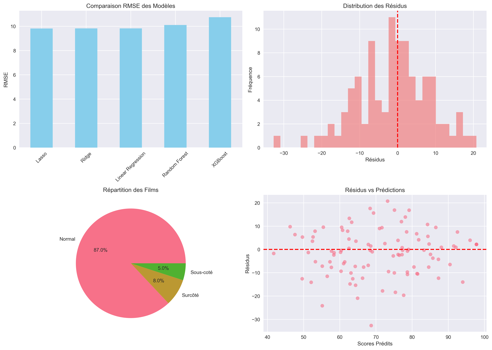

# Predicting Metacritic Scores from IMDb Data – Python, ML

Academic machine-learning project for predicting Metacritic scores from IMDb movie data, combining data collection, cleaning, exploratory analysis, feature engineering, regression models and model interpretation.



## Project workflow

The project collects movie information from IMDb and prepares features such as title, year, duration, IMDb rating, genres, director, actors, vote count and text information for regression analysis. The workflow covers data cleaning, exploratory analysis, feature engineering, model training, comparison and interpretation.

The models studied include Linear Regression, Ridge, Lasso, Random Forest and XGBoost. According to the project results, **Lasso** was selected with a test RMSE of `9.8132` and R² of `0.6693`.

The analysis also includes correlation study, feature importance, predictions versus observed scores, residual analysis, and identification of potentially over-rated or under-rated films.

## Technologies

Python, pandas, NumPy, scikit-learn, XGBoost, Beautiful Soup, Selenium, NLTK/TextBlob, Matplotlib, Seaborn, and Plotly.

## Installation and use

```bash
python -m venv .venv
# Windows: .venv\Scripts\activate
# Linux/macOS: source .venv/bin/activate
python -m pip install -r requirements.txt
jupyter lab metacritic_prediction.ipynb
```

The notebook contains the complete academic workflow from data preparation through model comparison and interpretation. Run it from the repository root after installing the dependencies.

## Available examples

The `images/` directory contains the project figures for exploratory analysis, distributions, correlations, feature importance, residual analysis and predictions versus observed values.

## Authors

- Adam El Akkaoui
- Mohammed Zaidouh

## Academic artefacts

- [French academic report (PDF)](docs/academic-report-fr.pdf).

## Project results

The project compares several regression approaches and selects Lasso with RMSE `9.8132` and R² `0.6693` on the project test split. The accompanying report and notebook document the data-processing choices, exploratory analysis, model comparison and interpretation of the predictions.
